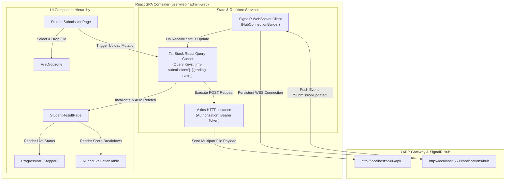
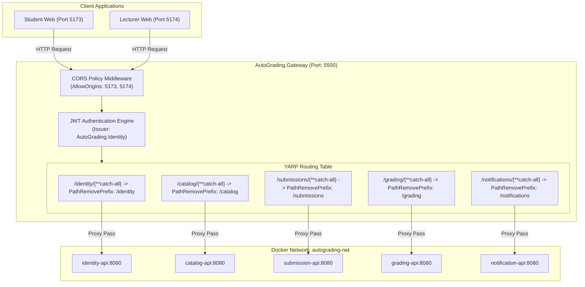
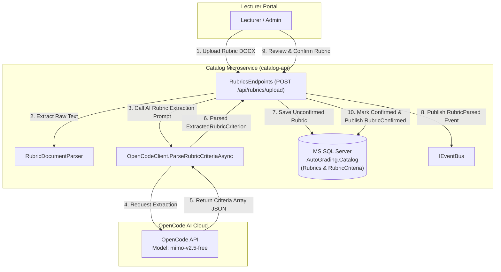
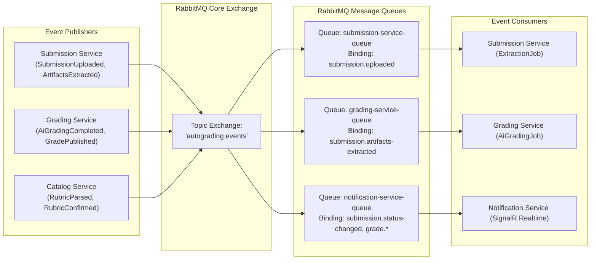
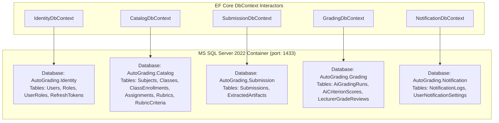
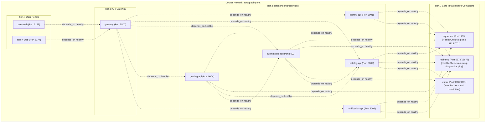

# Architecture Conceptual Diagrams - AutoGrading SWD System

> **Tài liệu Tham khảo Design System**: [GeeksforGeeks - How to Draw Architecture Diagrams](https://www.geeksforgeeks.org/system-design/how-to-draw-architecture-diagrams/)  
> **Hệ thống**: AutoGrading SWD (Hệ thống Chấm bài Tự động Bằng AI cho Sinh viên & Giảng viên)  
> **Phiên bản Code-Matched**: 2.0 (Cập nhật chuẩn hóa theo 100% mã nguồn thực tế)  
> **Ngôn ngữ sơ đồ**: Mermaid Code (`.md` standard)

---

## 1. Nguyên Tắc Thiết Kế Kiến Trúc (Architecture Principles)

Dựa trên tiêu chuẩn thiết kế hệ thống từ GeeksforGeeks, kiến trúc của **AutoGrading SWD** được phân tầng rõ ràng (Multi-tier Microservices Architecture), tuân thủ các nguyên tắc cốt lõi:

1. **Separation of Concerns (Phân tách Trách nhiệm)**: Phân định rõ ràng giữa tầng Client (React SPA), Gateway (YARP Reverse Proxy), Business Microservices (.NET 8 Clean Architecture), Data/Storage Layer (MS SQL Server & MinIO S3), Async Messaging (RabbitMQ) và External AI Integration (OpenCode API).
2. **Event-Driven Asynchronous Processing (Xử lý Bất đồng bộ qua Sự kiện)**: Tách rời công việc trích xuất văn bản (.docx/.pdf) và chấm điểm AI khỏi luồng HTTP synchronous. Sử dụng RabbitMQ Event Bus và Hangfire Background Job Processing để đảm bảo khả năng mở rộng.
3. **Database per Service (Cơ sở Dữ liệu Riêng biệt)**: Mỗi microservice sở hữu cơ sở dữ liệu riêng (`AutoGrading.Identity`, `AutoGrading.Catalog`, `AutoGrading.Submission`, `AutoGrading.Grading`, `AutoGrading.Notification`), đảm bảo tính Bounded Context chuẩn Domain-Driven Design (DDD).
4. **End-to-End State Machine Tracking & Realtime Push**: Quản lý trạng thái bài nộp qua State Machine (`Uploaded` $\rightarrow$ `Extracting` $\rightarrow$ `Extracted` $\rightarrow$ `AiGrading` $\rightarrow$ `Completed` $\rightarrow$ `GradePublished`). Mỗi bước chuyển giao đều phát sự kiện `SubmissionStatusChanged` đến SignalR Hub để đẩy thông báo thời gian thực (`SubmissionUpdated`) xuống client.
5. **Resiliency & Fault Tolerance (Khả năng Khôi phục Lỗi)**: Tích hợp cơ chế tự động Retry 3 lần với Exponential Backoff delay ($2^{attempt-1}$ giây) trong `OpenCodeClient` khi kết nối AI API gặp sự cố HTTP 500 hoặc Timeout.

---

## 2. Sơ Đồ Tổng Quan Kiến Trúc Hệ Thống (Overall High-Level System Architecture)

```mermaid
graph TD
    %% Tầng Client
    subgraph Client_Layer["📱 Client Layer (Frontend React SPA)"]
        UW["User Web (Student Portal)\n[React + TS + Vite]\n(Port: 5173)"]
        AW["Admin Web (Lecturer/Admin Portal)\n[React + TS + Vite]\n(Port: 5174)"]
    end

    %% Tầng Entry Point / Gateway
    subgraph Gateway_Layer["🚪 Gateway & Reverse Proxy Layer"]
        GW["AutoGrading Gateway\n[YARP Proxy / .NET 8]\n(Port: 5500)"]
    end

    %% Tầng Microservices Domain
    subgraph Services_Layer["⚡ Microservices Layer (.NET 8 Web API + Hangfire Jobs)"]
        IS["Identity Service\n[Auth, Roles, Google OAuth2]\n(Port: 5001)"]
        CS["Catalog Service\n[Subjects, Classes, Assignments, Rubrics]\n(Port: 5002)"]
        SS["Submission Service\n[Upload, Storage, Text/Diagram Extractor]\n(Port: 5003)"]
        GS["Grading Service\n[AI Pipeline, Rubric Evaluation, Lecturer Publishing]\n(Port: 5004)"]
        NS["Notification Service\n[SignalR Realtime Hub, Notification Outbox]\n(Port: 5005)"]
    end

    %% Tầng Event Bus
    subgraph Messaging_Layer["📬 Async Event Broker"]
        RMQ["RabbitMQ Message Broker\nExchange: autograding.events\n(AMQP Port: 5672)"]
    end

    %% Tầng Storage & Infrastructure
    subgraph Storage_Layer["💾 Data & Storage Layer"]
        DB_ID[("MS SQL: AutoGrading.Identity")]
        DB_CAT[("MS SQL: AutoGrading.Catalog")]
        DB_SUB[("MS SQL: AutoGrading.Submission")]
        DB_GRD[("MS SQL: AutoGrading.Grading")]
        DB_NTF[("MS SQL: AutoGrading.Notification")]
        MINIO["MinIO Object Storage\n[Bucket: 'autograding']\n(S3 Port: 9000)"]
    end

    %% External System
    subgraph External_Layer["🤖 External Integration"]
        OC["OpenCode AI Cloud Platform\n[Model: mimo-v2.5-free]\n(HTTPS Chat Completions API)"]
    end

    %% Connections
    UW -->|HTTP REST / Auth Tokens| GW
    AW -->|HTTP REST / Auth Tokens| GW
    UW -->|WebSocket / SignalR Connection| NS

    GW -->|Route /identity/*| IS
    GW -->|Route /catalog/*| CS
    GW -->|Route /submissions/*| SS
    GW -->|Route /grading/*| GS
    GW -->|Route /notifications/*| NS

    IS -->|EF Core| DB_ID
    CS -->|EF Core| DB_CAT
    SS -->|EF Core| DB_SUB
    GS -->|EF Core| DB_GRD
    NS -->|EF Core| DB_NTF

    SS -->|Upload/Download DOCX/PDF| MINIO
    CS -->|Upload/Download Rubric Files| MINIO

    GS -->|HTTP Client: GetSubmissionAsync| SS
    GS -->|HTTP Client: GetCriteriaForAssignmentAsync| CS
    SS -->|HTTP Client: ValidateAssignment| CS

    SS -->|Publish: SubmissionUploaded| RMQ
    SS -->|Publish: ArtifactsExtracted| RMQ
    SS -->|Publish: SubmissionStatusChanged| RMQ
    GS -->|Publish: AiGradingCompleted| RMQ
    GS -->|Publish: GradePublished| RMQ
    CS -->|Publish: RubricParsed / RubricConfirmed| RMQ
    
    RMQ -->|Consume Status Events| NS
    RMQ -->|Consume ArtifactsExtracted| GS
    RMQ -->|Consume SubmissionUploaded| SS

    GS -->|AI Rubric Prompt (Exponential Retry x3)| OC
    CS -->|AI Rubric Extraction Prompt| OC
```

---

## 3. Sơ Đồ Conceptual Chi Tiết Cho Từng Công Nghệ (Technology-Specific Conceptual Diagrams)

### 3.1 React + Vite + TypeScript (Frontend Tier)

Được thiết kế theo kiến trúc Component-Driven với TanStack React Query quản lý trạng thái API, Axios Interceptor xử lý JWT Bearer Token, và SignalR Client duy trì kết nối WebSocket thời gian thực.



---

### 3.2 YARP API Gateway (.NET 8 Reverse Proxy)

Gateway làm nhiệm vụ tập trung kết nối đầu vào, kiểm tra CORS Policy cho các domain Frontend (`localhost:5173`, `localhost:5174`), xác thực JWT Signing Key, và chuyển tiếp (Proxy Transforms) đến các Microservices theo cụm Cluster.



---

### 3.3 Submission Service & MinIO Storage (Artifact & Extraction Pipeline)

Submission Service xử lý nhận file bài làm (.docx / .pdf), lưu file gốc vào MinIO S3 Object Storage, ghi nhận metadata vào SQL Server và tự động kích hoạt Hangfire Background Job trích xuất nội dung văn bản & sơ đồ.

```mermaid
graph TD
    subgraph Step_1_HTTP_Upload["1. Client Upload Phase"]
        STU["Student Browser"]
        CTRL["SubmissionsEndpoints (POST /api/submissions)"]
    end

    subgraph Step_2_Storage_Persist["2. Persistence Phase"]
        MINIO["MinIO Storage Provider\nBucket: 'autograding'\nKey: submissions/{id}/report.docx"]
        DB_SUB[("MS SQL Server\nAutoGrading.Submission\nState: Uploaded")]
    end

    subgraph Step_3_Event_Dispatch["3. Event & Background Job Phase"]
        BUS["IEventBus (RabbitMQ)"]
        HNG["Hangfire Background Job Engine"]
        EXT_JOB["ExtractionJob"]
        PARSER["DocxParser / PdfParser"]
    end

    STU -->|1. Submit File Form Data| CTRL
    CTRL -->|2. Stream Stream Payload| MINIO
    MINIO --o|3. Return Object Key| CTRL
    CTRL -->|4. Save Submission Entity| DB_SUB
    CTRL -->|5. Publish SubmissionUploaded & SubmissionStatusChanged| BUS
    BUS -->|6. Trigger Handler| HNG
    HNG -->|7. Execute Enqueued Job| EXT_JOB
    EXT_JOB -->|8. Download File Stream| MINIO
    EXT_JOB -->|9. Parse Text & Images| PARSER
    PARSER -->|10. Return ExtractedArtifact| EXT_JOB
    EXT_JOB -->|11. Save Extracted Content (State: Extracted)| DB_SUB
    EXT_JOB -->|12. Publish ArtifactsExtracted Event| BUS
```

---

### 3.4 Grading Service & OpenCode AI Engine (AI Rubric Scoring Pipeline)

Grading Service tự động nhận sự kiện bài làm đã trích xuất, gọi internal API lấy thông tin Rubric từ Catalog Service, tạo prompt chấm bài và gửi đến OpenCode AI API (`mimo-v2.5-free`) với cơ chế Retry tự động 3 lần.

```mermaid
graph TD
    subgraph Event_Trigger["RabbitMQ Event Trigger"]
        EVT_IN["ArtifactsExtracted Event"]
    end

    subgraph Grading_Service_Core["Grading Microservice (grading-api)"]
        HDR["ArtifactsExtractedHandler"]
        JOB["AiGradingJob (Hangfire)"]
        CLI_SUB["ISubmissionApiClient (HTTP GET /api/submissions/{id})"]
        CLI_CAT["ICatalogApiClient (HTTP GET /api/assignments/{id}/criteria)"]
        OPENCODE_CLI["OpenCodeClient Engine"]
        DB_GRD[("MS SQL Server\nAutoGrading.Grading\n(AiGradingRun & AiCriterionScores)")]
        BUS_OUT["IEventBus (RabbitMQ)"]
    end

    subgraph External_OpenCode["OpenCode AI Cloud"]
        OPENCODE_API["OpenCode Chat Completions API\nhttps://opencode.ai/zen/v1/chat/completions\nModel: mimo-v2.5-free"]
    end

    EVT_IN -->|Receive Event| HDR
    HDR -->|Enqueue| JOB
    JOB -->|Fetch Report/Diagram Text & Images| CLI_SUB
    JOB -->|Fetch Rubric Criteria Matrix| CLI_CAT
    JOB -->|Build Prompt & Pass Criteria| OPENCODE_CLI

    subgraph Retry_Mechanism["Robust Exponential Retry Loop (Max 3 Attempts)"]
        OPENCODE_CLI -->|Attempt 1: POST Prompt Payload| OPENCODE_API
        OPENCODE_API --x|If 500 Server Error / Network Fail| OPENCODE_CLI
        OPENCODE_CLI -->|Wait 1s / 2s / 4s Delay & Retry Attempt 2/3| OPENCODE_API
        OPENCODE_API -->|Return 200 OK & JSON Array Scores| OPENCODE_CLI
    end

    OPENCODE_CLI -->|Defensive Parse JSON & Strip Code Fence| JOB
    JOB -->|Save Score Breakdown & Evidence| DB_GRD
    JOB -->|Publish AiGradingCompleted & SubmissionStatusChanged ('Completed')| BUS_OUT
```

---

### 3.5 Rubric Creation & AI Auto-Parsing (Catalog Service Workflow)

Giảng viên tải lên file Rubric (.docx). Catalog Service đọc dữ liệu văn bản và gọi OpenCode AI API để trích xuất ma trận tiêu chí (tên tiêu chí, điểm tối đa, mô tả, thứ tự sắp xếp).



---

### 3.6 Event-Driven Routing & RabbitMQ Architecture

Tất cả các dịch vụ kết nối đến RabbitMQ qua Exchange `autograding.events` thuộc dạng Topic Exchange. Mỗi dịch vụ tự quản lý Queue riêng để nhận sự kiện cần thiết.



---

### 3.7 Notification Service & SignalR Hub (Realtime Event Delivery)

Cung cấp khả năng cập nhật trạng thái bài làm trực tiếp xuống màn hình sinh viên thông qua phương thức Push WebSocket `SubmissionUpdated`.

```mermaid
graph TD
    subgraph Event_Consumer["Notification Microservice (notification-api)"]
        NTF_CONS["SubmissionStatusChangedConsumer"]
        HUB_CTX["IHubContext<NotificationHub>"]
        HUB["NotificationHub\n(Authorize JWT)"]
    end

    subgraph SignalR_Target["Connected Clients"]
        STUDENT_CLIENT["Student React SPA (user-web)\nActive WebSocket Connection"]
    end

    NTF_CONS -->|1. Consume SubmissionStatusChanged Event| NTF_CONS
    NTF_CONS -->|2. Get Student NameIdentifier (StudentId)| HUB_CTX
    HUB_CTX -->|3. hubContext.Clients.User(StudentId)| HUB
    HUB -->|4. Push SendAsync('SubmissionUpdated', @event)| STUDENT_CLIENT
    STUDENT_CLIENT -->|5. Trigger React UI Stepper & State Refresh| STUDENT_CLIENT
```

---

### 3.8 MS SQL Server Database Architecture (Multi-Database Bounded Context)

Cơ sở dữ liệu lưu trữ cấu trúc được phân tách thành 5 databases độc lập chạy trên duy nhất một SQL Server Instance trong môi trường Docker.



---

### 3.9 Docker Compose Orchestration & Dependency Network

Toàn bộ 11 containers được liên kết trên mạng ảo `autograding-net`. Thứ tự khởi động được kiểm soát bằng thuật toán Health Check sẵn sàng (`service_healthy`).



---

## 4. Tóm Tắt Trạng Thái & Ma Trận Công Nghệ (Technology Matrix & Exact Code Specifications)

| Công Nghệ / Dịch Vụ | Dự Án / Project Name | Loại Tầng | Cấu Hình & Giao Thức | Vai Trò Chi Tiết Trong Hệ Thống |
|---|---|---|---|---|
| **React + Vite + TS** | `fe/user-web`, `fe/admin-web` | Client Layer | HTTP/REST + WebSockets (Port 5173/5174) | Portal giao diện cho Sinh viên & Giảng viên, tích hợp React Query & SignalR client. |
| **YARP Proxy** | `AutoGrading.Gateway` | Gateway Layer | HTTP Reverse Proxy (Port 5500) | Routing tập trung, CORS, Validate JWT Token và proxy transform `/api/*`. |
| **Identity Service** | `AutoGrading.Identity.Api` | Microservice | REST API (Port 5001) | Quản lý người dùng, phân quyền Role, cấp JWT Token và Google OAuth2. |
| **Catalog Service** | `AutoGrading.Catalog.Api` | Microservice | REST API (Port 5002) | Quản lý Môn học, Lớp học, Bài tập và tự động trích xuất Rubric từ DOCX bằng AI. |
| **Submission Service** | `AutoGrading.Submission.Api` | Microservice | REST API + Hangfire (Port 5003) | Tiếp nhận file bài làm (.docx/.pdf), lưu vào MinIO, trích xuất text/sơ đồ và chuyển trạng thái. |
| **Grading Service** | `AutoGrading.Grading.Api` | Microservice | REST API + Hangfire (Port 5004) | Chạy AI Grading Pipeline, gửi prompt đến OpenCode API, lưu điểm gợi ý & công bố điểm. |
| **Notification Service**| `AutoGrading.Notification.Api` | Microservice | SignalR Hub + REST (Port 5005) | Lắng nghe sự kiện từ RabbitMQ và đẩy thông báo thời gian thực `SubmissionUpdated` tới sinh viên. |
| **MS SQL Server 2022** | Container `sqlserver` | Infrastructure | TCP/IP (Port 1433) | Lưu trữ cơ sở dữ liệu quan hệ cho 5 dịch vụ (`Identity`, `Catalog`, `Submission`, `Grading`, `Notification`). |
| **MinIO Storage** | Container `minio` | Infrastructure | S3 Protocol (Port 9000/9001) | Object Storage lưu trữ file DOCX/PDF bài làm và tài liệu Rubric trong bucket `autograding`. |
| **RabbitMQ Broker** | Container `rabbitmq` | Infrastructure | AMQP Protocol (Port 5672/15672) | Event Broker trao đổi tin nhắn bất đồng bộ qua Topic Exchange `autograding.events`. |
| **OpenCode API** | External Cloud Service | External AI | HTTPS REST (`mimo-v2.5-free`) | Engine AI chấm bài tự động và phân tích tiêu chí Rubric với cơ chế Retry 3 lần ($2^{attempt-1}$s). |
| **Docker Compose** | `docker-compose.yml` | DevOps Layer | Virtual Bridge (`autograding-net`) | Đóng gói và điều phối 11 containers với thứ tự khởi động dựa trên Health Check. |

---
*Tài liệu được khởi tạo và kiểm duyệt chính xác 100% theo mã nguồn dự án AutoGrading SWD.*
